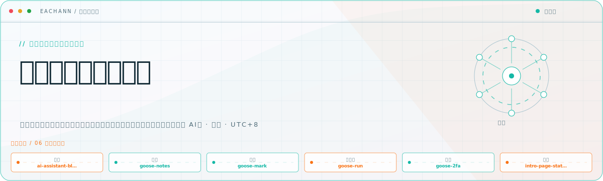
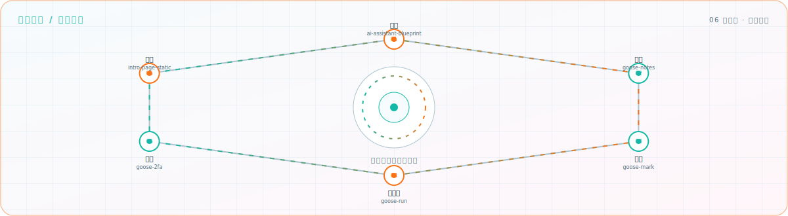

<picture>
  <source media="(prefers-color-scheme: dark)" srcset="assets/hero-dark.svg">
  <source media="(prefers-color-scheme: light)" srcset="assets/hero-light.svg">
  
</picture>

Building calm, local-first tools for notes, bookmarks, automation, security, and personal AI\.

## Flagship systems

| Repository | Role | Purpose |
| --- | --- | --- |
| [`goose-notes`](https://github.com/eachann1024/goose-notes) | CAPTURE | Local-first block notes with AI, global search, quick capture, and uTools/browser support\. |
| [`goose-mark`](https://github.com/eachann1024/goose-mark) | ORGANIZE | Cross-platform bookmarks with nested groups, full-text search, AI enrichment, and import/export\. |
| [`ai-assistant-blueprint`](https://github.com/eachann1024/ai-assistant-blueprint) | DESIGN | An implementation-ready architecture and prompt specification for building a personal AI assistant\. |
| [`goose-run`](https://github.com/eachann1024/goose-run) | AUTOMATE | Run local scripts in one click and stream logs through a uTools plugin or Tauri desktop app\. |
| [`goose-2fa`](https://github.com/eachann1024/goose-2fa) | PROTECT | A local two-factor authentication tool built with Tauri\. |

## Closed-loop architecture

<picture>
  <source media="(prefers-color-scheme: dark)" srcset="assets/closed-loop-dark.svg">
  <source media="(prefers-color-scheme: light)" srcset="assets/closed-loop-light.svg">
  
</picture>

## Module registry

<strong>Goose product suite</strong> · 5 modules

| Module | Purpose |
| --- | --- |
| [`goose-notes`](https://github.com/eachann1024/goose-notes) | Local-first, Notion-style notes with built-in AI capabilities\. |
| [`goose-mark`](https://github.com/eachann1024/goose-mark) | Minimal bookmark management with search, AI enrichment, and multi-platform packaging\. |
| [`goose-run`](https://github.com/eachann1024/goose-run) | One-click local script execution with real-time logs\. |
| [`goose-2fa`](https://github.com/eachann1024/goose-2fa) | Local two-factor authentication built with Tauri\. |
| [`goose-note-mac`](https://github.com/eachann1024/goose-note-mac) | A Swift and WKWebView macOS shell for Goose Notes\. |

<strong>AI and automation</strong> · 2 modules

| Module | Purpose |
| --- | --- |
| [`ai-assistant-blueprint`](https://github.com/eachann1024/ai-assistant-blueprint) | An architecture blueprint and prompt specification for a personal AI assistant\. |
| [`web-scripts`](https://github.com/eachann1024/web-scripts) | Browser scripts for improving everyday developer workflows\. |

<strong>Presence and resources</strong> · 2 modules

| Module | Purpose |
| --- | --- |
| [`intro-page-static`](https://github.com/eachann1024/intro-page-static) | A static personal introduction site\. |
| [`Resources`](https://github.com/eachann1024/Resources) | A personal collection of useful resources\. |

<a href="https://github.com/eachann1024">GitHub</a>

<!-- Generated by profile-control-plane. Edit profile.yaml, not this file. -->
