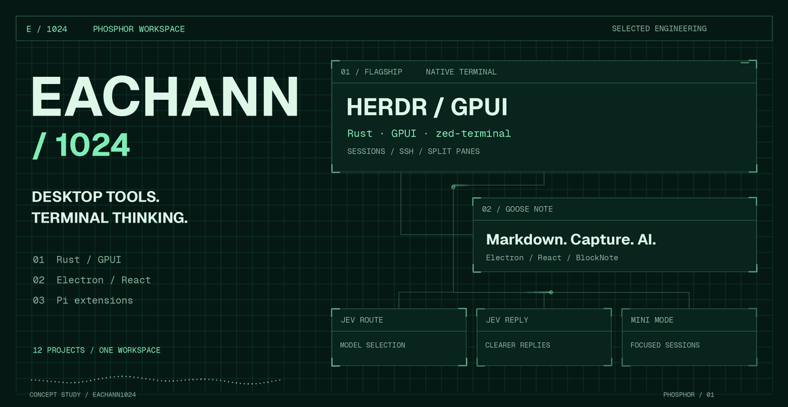
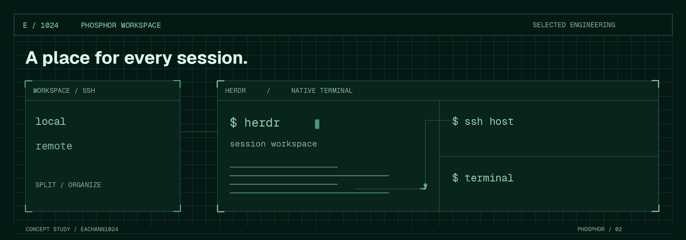
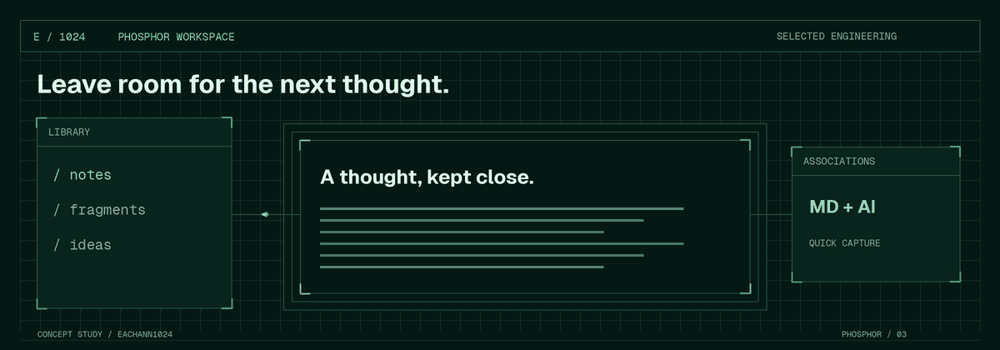

# eachann1024

**Desktop tools. Terminal thinking.**

把日常工作里的摩擦，做成值得反复使用的工具。

## 01 / Native workspace

### goose-herdr-gpui

**Sessions. SSH. Split terminals.**

macOS Rust/GPUI 客户端，组织 Herdr 会话、SSH 与终端分栏。

`Rust · GPUI · gpui-component · zed-terminal`



## 02 / A space for thought

### [goose-notes](https://github.com/eachann1024/goose-note-app/releases/latest)

**Local Markdown. Quick capture. AI.**

本地 Markdown、随手速记与 AI。

`TypeScript · React · Electron · BlockNote`



## 03 / The Pi collection

**Pi packages · 5K+ downloads**

三个独立扩展，为模型选择、回复表达与终端专注各尽其职。


### [pi-jev-route](https://github.com/eachann1024/pi-jev-route)

**The right model for the task.**

在 Pi 子代理派发前选择模型，提供本地设置与审计页。

`TypeScript · Pi Extension API · Pi AI`

```sh
pi install npm:@each1024/pi-jev-route
```

### [pi-jev-reply](https://github.com/eachann1024/pi-jev-reply)

**Less noise. More clarity.**

Jev 审阅与可选改写，让 Pi 回复更清楚。

`TypeScript · Pi Extension API · Pi TUI`

```sh
pi install npm:@each1024/pi-jev-reply
```

### [pi-mini-mode](https://github.com/eachann1024/pi-mini-mode)

**Less noise. More focus.**

紧凑页脚、实时用量与可配置进度条。

`TypeScript · Pi TUI · grok-mermaid`

```sh
pi install npm:@each1024/pi-mini-mode
```

## 04 / Everyday tools

### Goose Hub & family

#### [goose-2fa](https://github.com/eachann1024/goose-2fa)

**Local codes, close at hand.**

本地 TOTP / HOTP 与脱敏 MCP；uTools 版已冻结并迁入 Goose Hub。

`TypeScript · React · uTools · MCP`

#### goose-hub

**One home for everyday tools.**

macOS 统一应用启动器，聚合原源码组件。

`TypeScript · React · Electron · Rust`

#### goose-mark

**Keep the web within reach.**

本地书签、模板 URL 与 AI 补全；已迁入 Goose Hub。

`TypeScript · React · Vite · uTools`

#### goose-monitor

**Know what is running.**

进程归组、端口与网速；uTools 版已冻结并迁入 Goose Hub。

`TypeScript · Vite · uTools · MCP`

### Raycast editions

#### raycast-2fa

**Codes at command speed.**

本地验证码、图片扫码与 JSON 备份。

`TypeScript · Raycast API · Swift Vision`

#### raycast-mark

**Bookmarks from the keyboard.**

本地书签、二级分类与 JSON 导入导出。

`TypeScript · React · Raycast API`

#### raycast-monitor

**Find. Inspect. Quit.**

按应用名、PID 或端口查找并结束进程。

`TypeScript · React · Raycast API / Utils`

